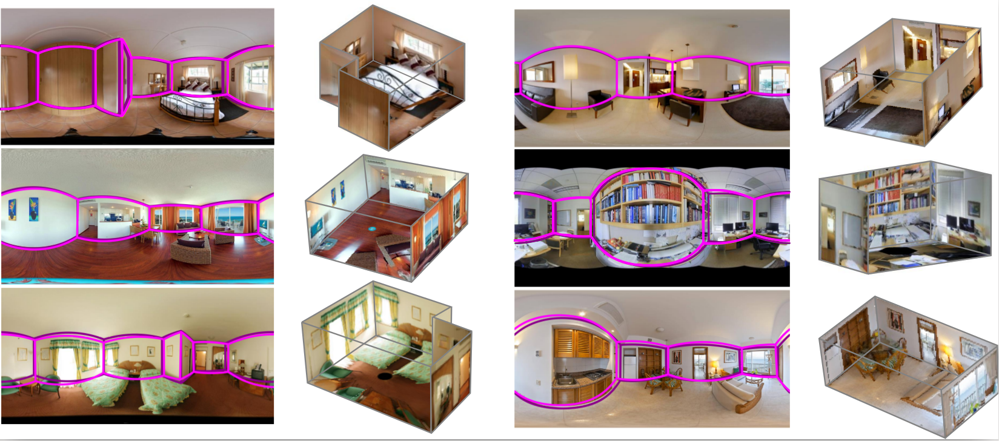

# CFL: End-to-End Layout Recovery from 360 Images
Tensorflow implementation of our end-to-end model to recover 3D layouts.

## Introduction
This repository contains original implementation of the [paper](https://arxiv.org/abs/1903.08094) 'Corners for Layout: End-to-End Layout Recovery from 360 Images' by Clara Fernandez-Labrador*, José M. Fácil*, Alejandro Perez-Yus, Cédric Demonceaux, Javier Civera and José J. Guerrero.

The page of the paper is https://cfernandezlab.github.io/CFL/ 

<p align="center">

  </p>

## Citing
Please cite CFL in your publications if it helps your research:
```bibtex
@article{fernandez2019CFL,
  title={Corners for Layout: End-to-End Layout Recovery from 360 Images},
  author={Fernandez-Labrador, Clara and Fácil, José M and Perez-Yus, Alejandro and Demonceaux, Cédric and Civera, Javier and Guerrero, José J},
  journal={arXiv:1903.08094},
  year={2019}
}
```

## Use Instructions
We recommend the use of a virtual enviroment for the use of this project. (*e.g.* [pew](https://github.com/berdario/pew))
```bash
$ pew new venvname -p python3 # replace venvname with your prefered name (it also works with python 2.7)
```
### Install Requirements
#### 1. This code has been compiled and tested using:
  - python3
  - g++-4.9
  - cuda-10.0
  - cuDNN 7.5
  - TensorFlow 1.13
 
 You are free to try different configurations. But we do not ensure it had been tested.
#### 2. Install  python requirements:
  ```bash
  (venvname)$ pip install -r requirements.txt
  ```
#### 3. Compile Deformable Convolutions:


  We use [this](https://github.com/Zardinality/TF_Deformable_Net) Deformable Convolutions implementation to create EquiConvs, a novel implementation of the convolution for 360º images that adapts the shape of the kernel accordingly to the equirectangular projection distortions. Valid for any task involving panoramic images!
  
  First, make sure to modify [Models/make.sh](Models/make.sh) with your computer settings (*i.e.* CUDA_HOME, CUDA Architecture). Second run the following commands.
  ```bash
  (venvname)$ cd Models
  (venvname)$ bash make.sh
  ```


### Download Dataset
SUN360: [download](http://webdiis.unizar.es/~jmfacil/cfl/sun360)

### Download Models
StdConvs version: [download](http://webdiis.unizar.es/~jmfacil/cfl/stdconvs)

EquiConvs version: [download](http://webdiis.unizar.es/~jmfacil/cfl/equiconvs)
### Run Test
Edit the config file so that the path to the dataset folder and the network parameters is correct.

To run our demo please run:
```bash
(venvname)$ python test_CFL.py --dataset Datasets/SUN360/test --weights Weights/StdConvs/model.ckpt --network StdConvs --results results_std # Runs the test examples with Standard Convolutions and save results in 'results_std'
```
```bash
(venvname)$ python test_CFL.py --dataset Datasets/SUN360/test --weights Weights/EquiConvs/model.ckpt --network EquiConvs --results results_equi --network EquiConvs # Runs the test examples with Equirectangular Convolutions and save results in 'results_equi'
```
## Contact
You can find our contact information in our personal websites [Clara](https://cfernandezlab.github.io) and [Jose M.](http://webdiis.unizar.es/~jmfacil/)

## License 
This software is under GNU General Public License Version 3 (GPLv3), please see [GNU License](http://www.gnu.org/licenses/gpl.html)

For commercial purposes, please contact the authors.


## Disclaimer

This site and the code provided here are under active development. Even though we try to only release working high quality code, this version might still contain some issues. Please use it with caution.
